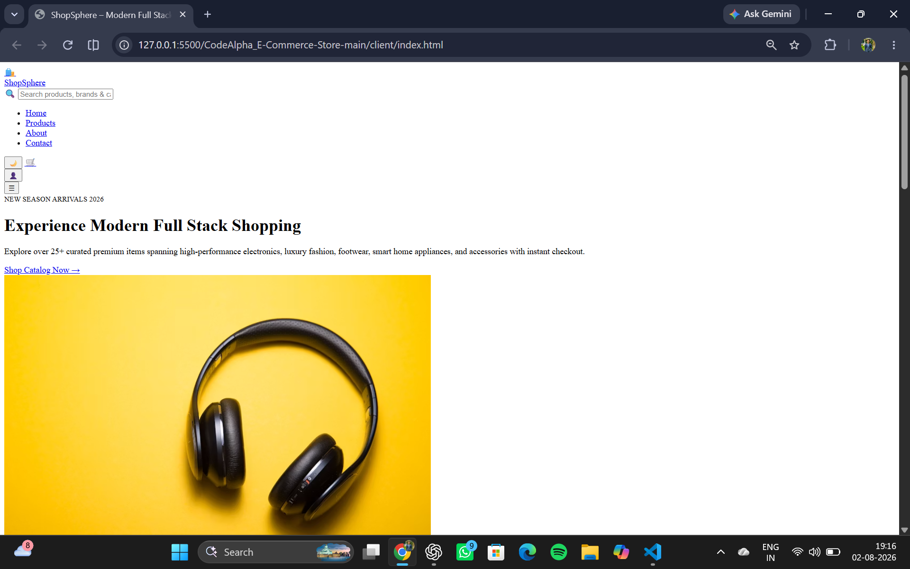
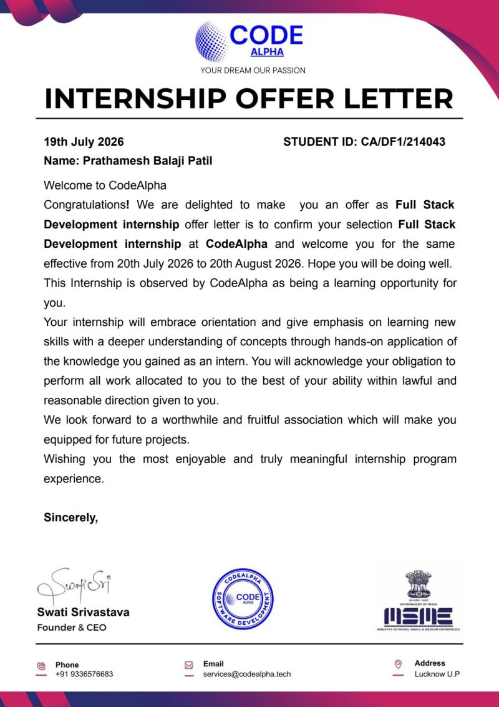
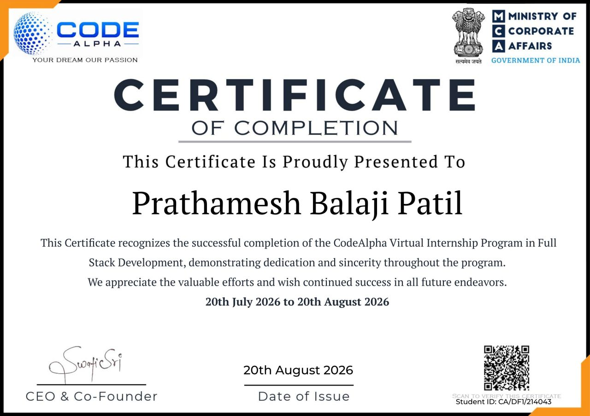

# 🚀 CodeAlpha Full Stack Development Internship

## 👨‍💻 About the Internship

This repository documents my **CodeAlpha Full Stack Development Internship**, including the projects developed, internship tasks, deployment work, and official internship documentation.

During the internship, I worked on practical full-stack applications with a focus on frontend development, backend APIs, database integration, authentication, deployment, and real-world web application workflows.

### 📅 Internship Details

| Detail | Information |
|---|---|
| **Organization** | CodeAlpha |
| **Domain** | Full Stack Development |
| **Duration** | 20 July 2026 - 20 August 2026 |
| **Mode** | Virtual Internship |
| **Intern** | Prathamesh Balaji Patil |

---

# 🛍️ Project 1: ShopSphere

### Modern Full Stack E-Commerce Store

**🌐 Live Demo:**  
https://modern-full-stack-e-commerce-store.vercel.app/

ShopSphere is a modern e-commerce web application developed to provide a complete online shopping experience with product browsing, authentication, cart management, wishlist functionality, checkout and order management.

<p align="center">
  
</p>

### ✨ Features

- 🔐 User registration and login
- 🔑 JWT authentication
- 👤 User profiles
- 🛒 Shopping cart
- ❤️ Wishlist
- 📦 Product catalog
- 🔎 Product search
- 🎯 Product filtering
- ⭐ Product ratings
- 📄 Pagination
- 🧾 Checkout workflow
- 📋 Order history
- 🛡️ Protected routes
- 🌗 Dark/light mode
- 🔔 Notifications
- 📱 Responsive design
- 🗄️ MongoDB database

### 🛠️ Tech Stack

**Frontend:** HTML5, CSS3, JavaScript  
**Backend:** Node.js, Express.js  
**Database:** MongoDB, Mongoose  
**Authentication:** JWT, bcryptjs  
**Deployment:** Vercel

---

# ⚡ Project 2: PulseNet

### Social Media Web Application

**🌐 Live Demo:**  
https://pulse-net-social-media.vercel.app/feed.html

PulseNet is a social media platform that allows users to create posts, upload images, interact with content, follow users and communicate through a modern social feed.


<p align="center">
  
</p>

### ✨ Features

- 🔐 User registration and login
- 🔑 JWT authentication
- 👤 Profile management
- 🖼️ Profile image upload
- 📝 Create posts
- 📷 Image posts
- ❤️ Like/unlike posts
- 💬 Comments
- 👥 Follow/unfollow users
- 🔎 User search
- 💌 Messaging
- 🌗 Theme support
- 🔔 Notifications
- 📱 Responsive interface
- 🛡️ Protected routes
- 🗄️ MongoDB integration

### 🛠️ Tech Stack

**Frontend:** HTML5, CSS3, JavaScript  
**Backend:** Node.js, Express.js  
**Database:** MongoDB, Mongoose  
**Authentication:** JWT, bcryptjs  
**Deployment:** Vercel

---

# 🎯 Internship Skills

Through these projects, I gained practical experience with:

- HTML5
- CSS3
- JavaScript ES6+
- DOM Manipulation
- Fetch API
- REST APIs
- Node.js
- Express.js
- MongoDB
- Mongoose
- JWT Authentication
- Password Hashing
- CRUD Operations
- Middleware
- API Validation
- File Uploads
- Git & GitHub
- Vercel Deployment
- Environment Variables
- Debugging and Testing
- Frontend-Backend Integration

---

# 📚 Development Workflow

```text
Frontend UI
    ↓
JavaScript / Fetch API
    ↓
REST API
    ↓
Node.js + Express.js
    ↓
Mongoose
    ↓
MongoDB
    ↓
API Response
    ↓
Frontend UI Update
```

---

# 📩 Internship Task Submission

The internship provided a task submission portal containing the assigned project requirements.

<p align="center">
  
</p>

---

# 📬 Internship Completion Email

After completing the internship requirements, I received the official completion communication regarding the internship completion certificate and Letter of Recommendation.

<p align="center">
  
</p>

---

# 📜 Internship Offer Letter

<p align="center">
  
</p>

The offer letter confirms my selection for the **CodeAlpha Full Stack Development Internship** from **20 July 2026 to 20 August 2026**.

---

# 🏆 Certificate of Completion

<p align="center">
  
</p>

The certificate recognizes the successful completion of the **CodeAlpha Virtual Internship Program in Full Stack Development**.

---

# 🚀 Live Projects

| Project | Live Demo |
|---|---|
| 🛍️ ShopSphere | [Open Live Project](https://modern-full-stack-e-commerce-store.vercel.app/) |
| ⚡ PulseNet | [Open Live Project](https://pulse-net-social-media.vercel.app/feed.html) |

---

# 👨‍💻 Author

## Prathamesh Balaji Patil

**Computer Science Engineering Student | AI & Machine Learning**

### 🔗 GitHub

[github.com/Shree0802](https://github.com/Shree0802)

---

## 📄 License

These projects were developed as part of the **CodeAlpha Full Stack Development Internship** and are maintained for educational and portfolio purposes.
