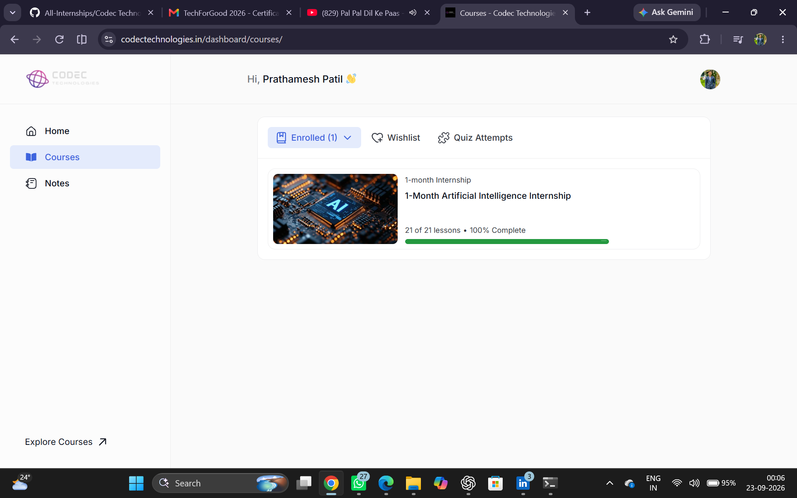
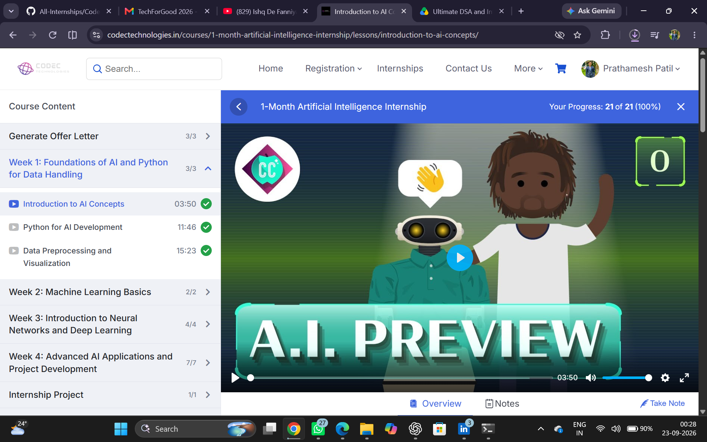
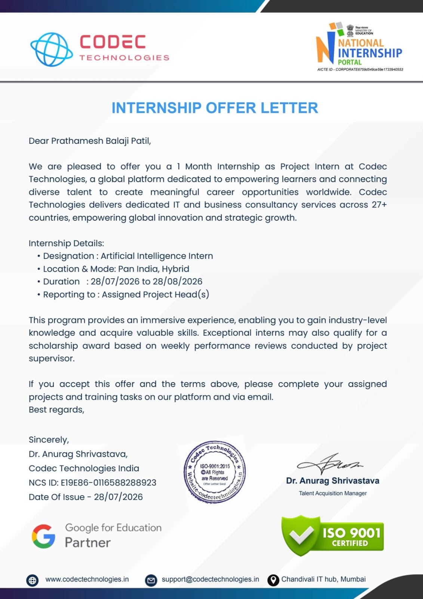
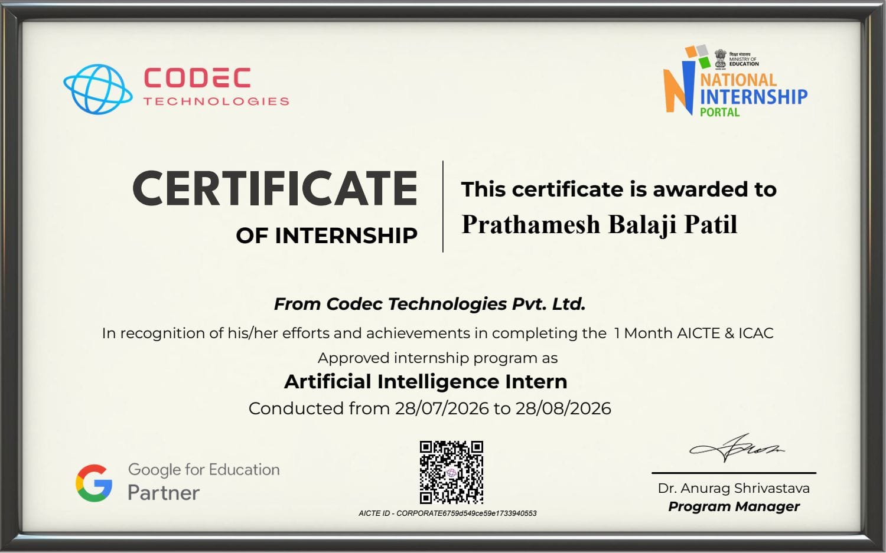
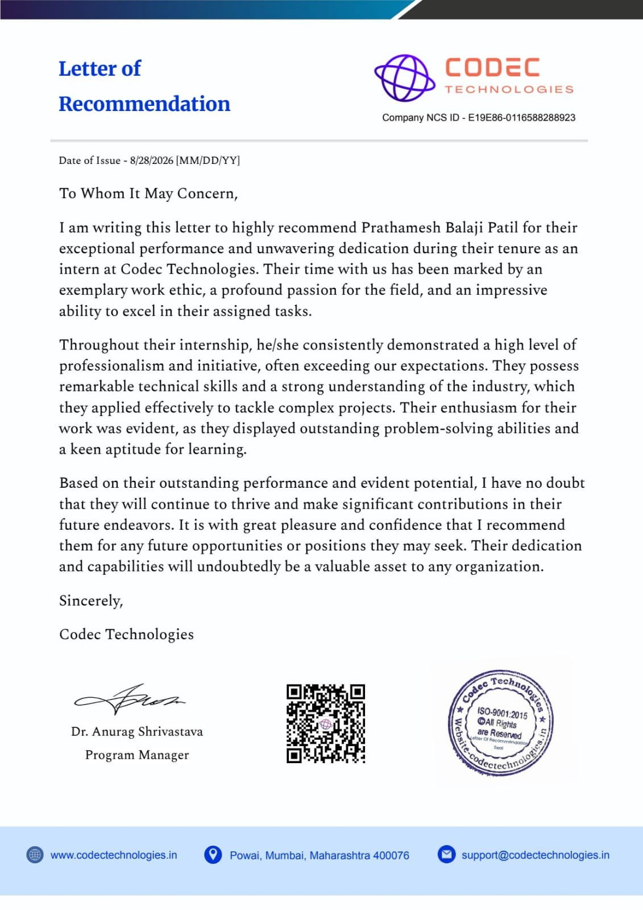

# 🤖 Artificial Intelligence Internship | Codec Technologies

<p align="center">


</p>

<p align="center">
  <b>1-Month Artificial Intelligence Internship</b><br>
  Codec Technologies Pvt. Ltd. | National Internship Portal
</p>

<p align="center">
  📅 <b>28 July 2026 – 28 August 2026</b>
</p>

---

## 📌 About the Internship

This repository documents my **1-Month Artificial Intelligence Internship at Codec Technologies Pvt. Ltd.**, completed from **28 July 2026 to 28 August 2026**.

The internship provided structured learning and hands-on exposure to **Artificial Intelligence, Python, Machine Learning, Deep Learning, Natural Language Processing, Data Preprocessing, Model Development, and AI application development**.

The program consisted of **21 lessons**, all successfully completed with a **100% completion rate**.

---

# 🎯 Internship Objective

The primary objective of this internship was to develop a practical foundation in Artificial Intelligence and understand the complete workflow of building AI and Machine Learning applications.

### Key Objectives

- Understand Artificial Intelligence fundamentals
- Learn Python for AI development
- Work with datasets
- Perform data preprocessing and visualization
- Understand Machine Learning algorithms
- Build classification and regression models
- Explore Neural Networks and Deep Learning
- Understand Natural Language Processing
- Develop practical AI/ML projects
- Deploy Machine Learning applications
- Document and publish projects using GitHub

---

# 📚 Internship Curriculum

The internship followed a structured learning path covering four major phases.

## Week 1: Foundations of AI & Python for Data Handling

- Introduction to Artificial Intelligence
- AI concepts and applications
- Python for AI development
- Data handling
- Data preprocessing
- Exploratory Data Analysis
- Data visualization

## Week 2: Machine Learning Basics

- Introduction to Machine Learning
- Supervised Learning
- Regression
- Classification
- Training and testing datasets
- Feature engineering
- Model evaluation
- Model comparison
- Machine Learning workflow

## Week 3: Neural Networks & Deep Learning

- Introduction to Neural Networks
- Artificial Neural Networks
- Deep Learning fundamentals
- Neural network architecture
- Model training
- Introduction to CNNs
- Image-based Machine Learning applications

## Week 4: Advanced AI Applications & Project Development

- Advanced AI applications
- Natural Language Processing
- AI project development
- Machine Learning deployment
- Streamlit application development
- Project documentation
- GitHub publishing

---

# 📊 Internship Progress

The internship was completed through the Codec Technologies online learning platform.

### Course Progress

```text
Course             : 1-Month Artificial Intelligence Internship
Lessons Completed  : 21 / 21
Course Completion  : 100%
Project Work       : Completed
```

<p align="center">
  
</p>

<p align="center">
  <i>Codec Technologies Internship Dashboard showing 100% course completion</i>
</p>

---

# 📖 Course Content

The internship curriculum included structured lessons covering Artificial Intelligence, Python, Data Preprocessing, Machine Learning, Neural Networks, Deep Learning, and advanced AI applications.

<p align="center">
  
</p>

<p align="center">
  <i>Artificial Intelligence Internship course content and learning modules</i>
</p>

---

# 💻 Internship Project Work

The internship included a dedicated project development phase where practical AI/ML projects were developed and published.

<p align="center">
  
</p>

<p align="center">
  <i>Internship project development module</i>
</p>

---

# 🚀 Projects Completed

## 1️⃣ Weather Temperature Prediction

An end-to-end Machine Learning project designed to analyze historical weather data and predict temperature trends.

### Key Components

- Data cleaning
- Missing value handling
- Exploratory Data Analysis
- Feature engineering
- Time-based features
- Regression model development
- Model comparison
- Model evaluation
- Temperature prediction
- Interactive Streamlit dashboard

### Technologies

`Python` `Pandas` `NumPy` `Scikit-Learn` `Matplotlib` `Plotly` `XGBoost` `Streamlit`

### 🌐 Live Application

[Weather Temperature Prediction](https://weather-temperature-prediction-3jgs3a5gmtyunyqdyjdwxw.streamlit.app/)

---

## 2️⃣ Spam Email Classifier

A Machine Learning and Natural Language Processing application that classifies messages as **Spam** or **Ham/Safe**.

### Key Components

- Text preprocessing
- Tokenization
- Stopword removal
- Stemming
- Lemmatization
- TF-IDF vectorization
- NLP feature extraction
- Classification
- Model comparison
- Interactive prediction interface

### Machine Learning Models

- Multinomial Naive Bayes
- Logistic Regression
- Support Vector Machine

### Technologies

`Python` `Pandas` `NumPy` `Scikit-Learn` `NLTK` `TF-IDF` `Streamlit` `Matplotlib` `Seaborn` `WordCloud`

### 🌐 Live Application

[Spam Email Classifier](https://spam-email-classifier-26r5kcjbnn9ecqv4tmbh5w.streamlit.app/)

---

# 🔄 Machine Learning Workflow

```text
┌───────────────────────────┐
│   Problem Definition     │
└─────────────┬─────────────┘
              ↓
┌───────────────────────────┐
│    Data Collection       │
└─────────────┬─────────────┘
              ↓
┌───────────────────────────┐
│   Data Preprocessing     │
└─────────────┬─────────────┘
              ↓
┌───────────────────────────┐
│ Exploratory Data Analysis│
└─────────────┬─────────────┘
              ↓
┌───────────────────────────┐
│   Feature Engineering    │
└─────────────┬─────────────┘
              ↓
┌───────────────────────────┐
│    Model Development     │
└─────────────┬─────────────┘
              ↓
┌───────────────────────────┐
│    Model Evaluation      │
└─────────────┬─────────────┘
              ↓
┌───────────────────────────┐
│    Model Selection       │
└─────────────┬─────────────┘
              ↓
┌───────────────────────────┐
│ Streamlit Deployment     │
└───────────────────────────┘
```

---

# 🧠 Skills Developed

### Programming
- Python
- Object-Oriented Programming fundamentals
- Modular programming
- File handling
- Exception handling

### Data Science
- NumPy
- Pandas
- Data Cleaning
- Data Preprocessing
- Exploratory Data Analysis
- Data Visualization

### Machine Learning
- Regression
- Classification
- Feature Engineering
- Model Training
- Model Evaluation
- Model Comparison
- Cross-Validation
- Model Selection

### Natural Language Processing
- Text preprocessing
- Tokenization
- Stopword removal
- Stemming
- Lemmatization
- TF-IDF
- Text Classification

### Deep Learning
- Neural Networks
- ANN fundamentals
- CNN fundamentals
- Deep Learning concepts

### Deployment
- Streamlit
- ML model serialization
- Interactive dashboards
- Web-based ML applications

### Development Tools
- Git
- GitHub
- Jupyter Notebook
- VS Code
- Pytest

---

# 🧰 Technology Stack

| Category | Technologies |
|---|---|
| Programming | Python |
| Data Processing | Pandas, NumPy |
| Visualization | Matplotlib, Seaborn, Plotly |
| Machine Learning | Scikit-Learn, XGBoost |
| NLP | NLTK, TF-IDF |
| Deep Learning | Neural Networks, CNN Concepts |
| Deployment | Streamlit |
| Development | VS Code, Jupyter Notebook |
| Version Control | Git, GitHub |
| Testing | Pytest |

---

# 📄 Internship Offer Letter

I was selected for a **1-Month Artificial Intelligence Internship** at Codec Technologies Pvt. Ltd. as an Artificial Intelligence / Project Intern.

The internship was conducted from **28 July 2026 to 28 August 2026**.

<p align="center">
  
</p>

<p align="center">
  <i>Official Internship Offer Letter issued by Codec Technologies</i>
</p>

---

# 🏅 Artificial Intelligence Training Certificate

Successfully completed the **Artificial Intelligence Training Program** at Codec Technologies.

<p align="center">
  
</p>

<p align="center">
  <i>Artificial Intelligence Training Certificate</i>
</p>

---

# 🎓 Internship Completion Certificate

Successfully completed the **1-Month AICTE & ICAC Approved Artificial Intelligence Internship Program** at Codec Technologies.

<p align="center">
  
</p>

<p align="center">
  <i>Official Internship Completion Certificate</i>
</p>

---

# 📝 Letter of Recommendation

Received a **Letter of Recommendation from Codec Technologies** recognizing my work and contributions during the internship.

The recommendation highlights:

- Technical skills
- Professionalism
- Initiative
- Problem-solving ability
- Learning aptitude
- Project involvement

<p align="center">
  
</p>

<p align="center">
  <i>Letter of Recommendation issued by Codec Technologies</i>
</p>

---

# 📈 Key Learning Outcomes

Through this internship, I gained practical experience in:

- Building Machine Learning pipelines
- Working with datasets
- Data preprocessing
- Exploratory Data Analysis
- Feature engineering
- Machine Learning model development
- Model comparison and evaluation
- Natural Language Processing
- Text classification
- Neural Network fundamentals
- Deep Learning concepts
- Building interactive AI applications
- Deploying ML applications using Streamlit
- Git and GitHub based project management
- Technical documentation

---

# 🏆 Internship Credentials

| Credential | Status |
|---|---|
| Internship Offer Letter | ✅ Received |
| AI Training Certificate | ✅ Completed |
| Internship Completion Certificate | ✅ Completed |
| Letter of Recommendation | ✅ Received |
| AI/ML Projects | ✅ Completed |
| Internship Lessons | ✅ 21/21 Completed |
| Course Completion | ✅ 100% |

---

# 📁 Repository Structure

```text
Codec-Technologies-AI-Internship/
│
├── README.md
│
├── certificates/
│   ├── Internship_Completion_Certificate.jpeg
│   ├── Internship_Training_Certificate.jpeg
│   └── Letter_of_Recommendation.jpeg
│
├── internship_documents/
│   └── Internship_Offer_Letter.jpeg
│
├── internship_progress/
│   ├── Internship_Dashboard.png
│   ├── Internship_Content.png
│   └── Internship_Project.png
│
├── projects/
│   ├── Weather-Temperature-Prediction/
│   └── Spam-Email-Classifier/
│
└── LICENSE
```

---

# 🎓 Internship Details

| Detail | Information |
|---|---|
| **Organization** | Codec Technologies Pvt. Ltd. |
| **Role** | Artificial Intelligence Intern / Project Intern |
| **Duration** | 28 July 2026 – 28 August 2026 |
| **Mode** | Pan India, Hybrid |
| **Program** | 1-Month Artificial Intelligence Internship |
| **Lessons Completed** | 21 / 21 |
| **Completion** | 100% |
| **Focus Areas** | AI, ML, Python, NLP, Deep Learning |

---

# 💡 Overall Learning Journey

This internship provided an opportunity to move from **AI/ML concepts to practical implementation**.

```text
AI Fundamentals
      ↓
Python
      ↓
Data Handling
      ↓
Machine Learning
      ↓
Neural Networks
      ↓
Deep Learning
      ↓
Natural Language Processing
      ↓
Project Development
      ↓
Model Deployment
```

The combination of structured coursework, practical projects, project documentation, and deployment helped strengthen my understanding of the **AI/ML development lifecycle**.

---

# 👨‍💻 Author

### Prathamesh Balaji Patil

**Computer Science Engineering | Artificial Intelligence & Machine Learning**

### Areas of Interest

`Artificial Intelligence` • `Machine Learning` • `Deep Learning` • `Data Science` • `NLP` • `Software Development`

---

# ⭐ Repository Highlights

```text
📚 Structured AI/ML Learning
        ↓
🐍 Python & Data Handling
        ↓
🤖 Machine Learning
        ↓
🧠 Neural Networks & Deep Learning
        ↓
💬 Natural Language Processing
        ↓
💻 Practical AI/ML Projects
        ↓
🌐 Streamlit Deployment
        ↓
📜 Internship Credentials
```

---

<p align="center">

### 🚀 Learn • Build • Deploy • Grow

</p>

<p align="center">
  ⭐ If you find this repository useful, consider giving it a star!
</p>
