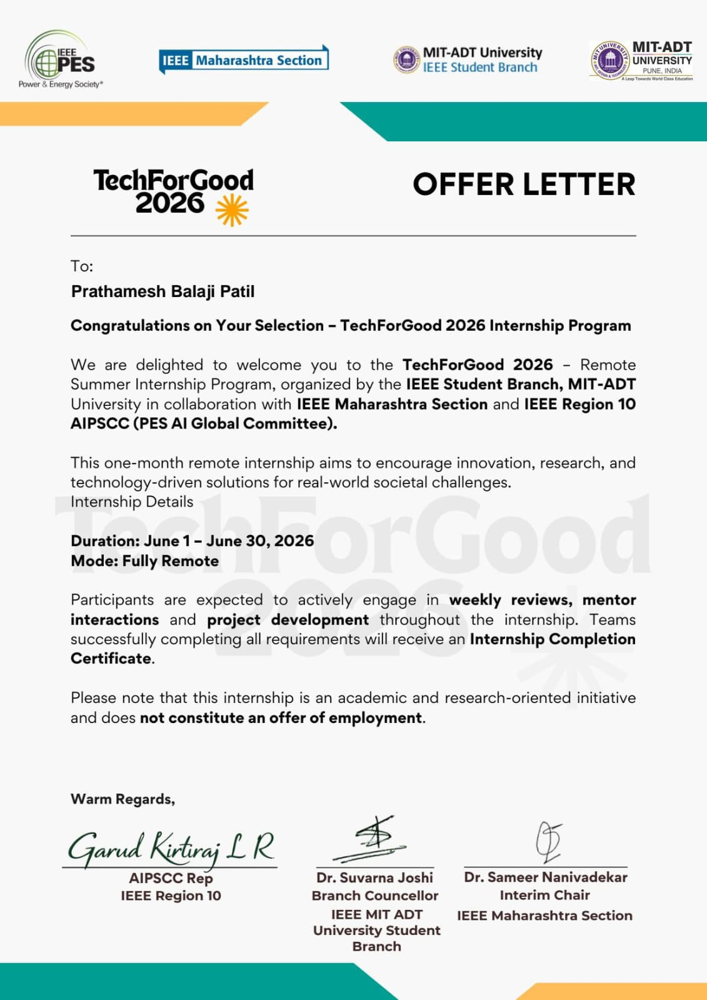
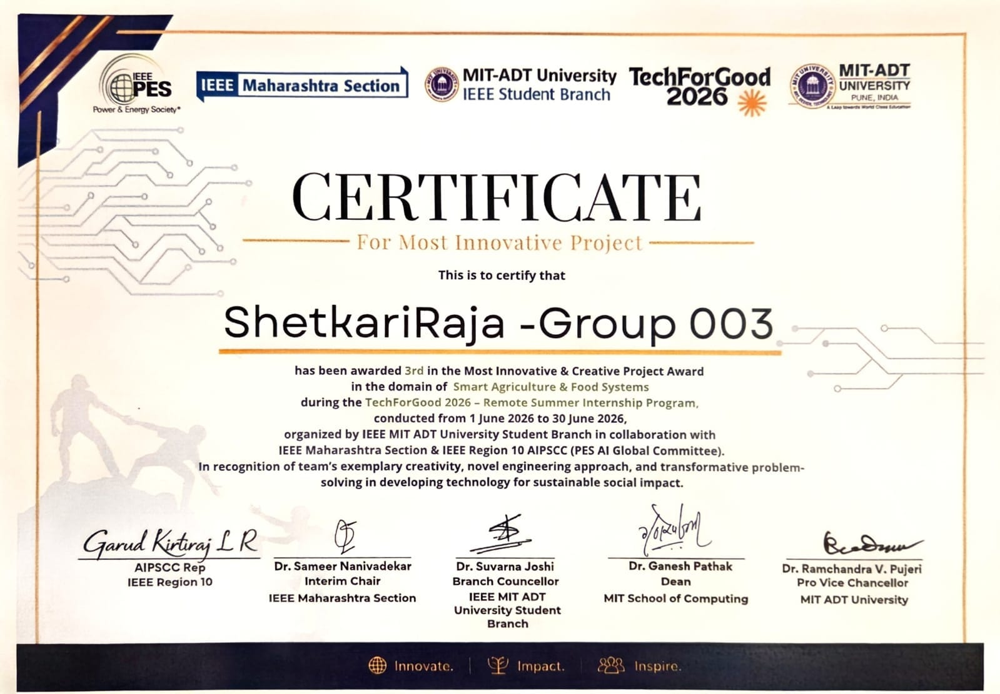
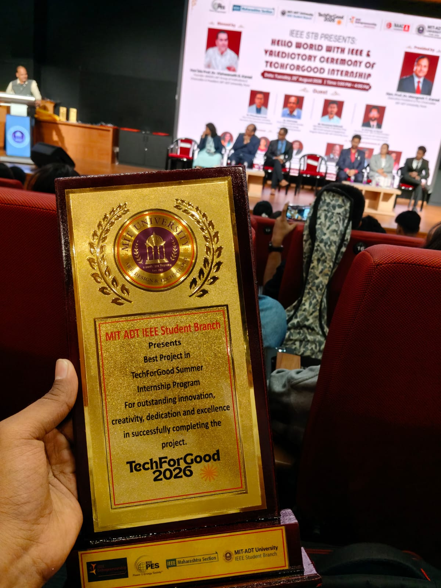
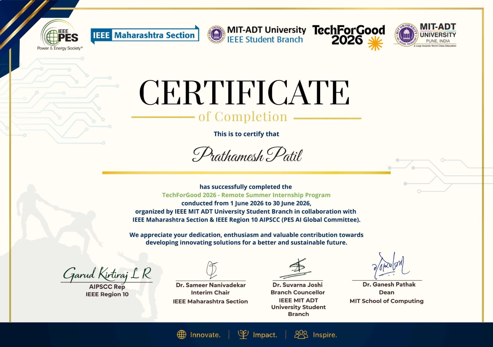
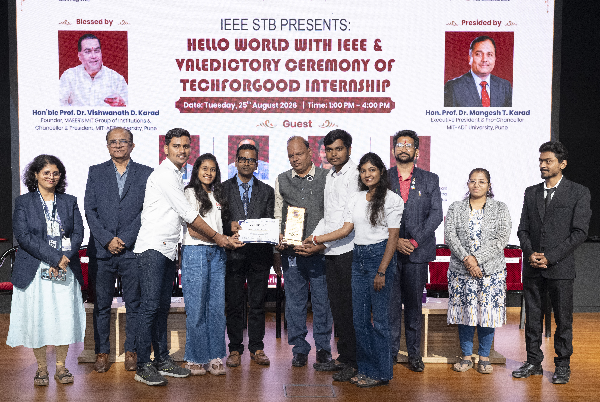

<div align="center">

# 🌾⚡ KRISHIMITRA AI ⚡🌾

### 🚀 Centralized Farmer Intelligence Operating System

### Multilingual Online & Offline AI Chatbot • Government Scheme Advisory • Soil Health Intelligence • Crop Planning • Post-Harvest Management • Food Waste Reduction • Market Intelligence • Sustainable Agriculture

<br/>


<br/>

### 🏆 TechForGood 2026 • IEEE MIT-ADT University
### 👨‍🌾 Team ShetkariRaja

<br/>

## 📲 DOWNLOAD THE APP

<a href="https://drive.google.com/file/d/1beCwJB1xQ4BYPfs8IbpEgqm63o_BAtIQ/view?usp=drivesdk">

</a>

<br/><br/>

**🔗 Direct Link:**  
https://drive.google.com/file/d/1beCwJB1xQ4BYPfs8IbpEgqm63o_BAtIQ/view?usp=drivesdk

</div>

---

<div align="center">

## 🧭 QUICK NAVIGATION

</div>

| 📖 [Overview](#-overview) | 🎓 [Internship](#-techforgood-2026-internship) | 🎯 [Objectives](#-objectives) | 🧠 [Innovation](#-core-innovation) |
|:---:|:---:|:---:|:---:|
| 🚀 [Features](#-features) | 🤖 [AI Stack](#-ai-stack) | 🛠 [Tech Stack](#-tech-stack) | 📱 [Offline AI](#-offline-ai-pipeline) |
| 🏆 [Recognition](#-project-recognition) | 👨‍💻 [Team](#-team) | 🎓 [Completion](#-internship-completion) | 🎉 [Ceremony](#-techforgood-2026-valedictory-ceremony) |

---

# 📖 Overview

> **KrishiMitra AI** is a **Centralized Farmer Intelligence Platform** designed to empower Indian farmers with AI-powered decision support throughout the complete agricultural lifecycle, from **soil to sale**.

Unlike traditional agricultural applications, KrishiMitra AI brings multiple agricultural intelligence modules together through a **Centralized Farmer Brain**.

The platform supports both **online and offline AI**, making it useful in rural areas where internet connectivity may be limited or unavailable.

KrishiMitra AI focuses on:

- 🌱 Soil and crop intelligence
- 🌾 Crop planning
- 🧪 Soil health analysis
- 🍅 Harvest and freshness prediction
- 📦 Storage recommendations
- 📈 Market intelligence
- ♻️ Food waste reduction
- 🏛 Government scheme discovery
- 🌍 Sustainable agriculture
- 🎤 Multilingual voice assistance
- 🤖 Online and offline AI assistance

---

# 🏆 Achievement Highlights

<div align="center">

### 🥉 3rd Place — Most Innovative & Creative Project

🌾 **Domain:** Smart Agriculture & Food Systems

🏫 **Program:** TechForGood 2026 – Remote Summer Internship

🤝 **Organized by:** IEEE MIT-ADT University Student Branch in collaboration with IEEE Maharashtra Section & IEEE Region 10 AIPSCC

📱 **Project:** KrishiMitra AI

🧠 **Focus:** AI-powered agricultural intelligence and farmer assistance

</div>

---

# 🎓 TechForGood 2026 Internship

KrishiMitra AI was developed as part of the **TechForGood 2026 Remote Summer Internship Program**, organized by the **IEEE Student Branch, MIT-ADT University**, in collaboration with the **IEEE Maharashtra Section** and **IEEE Region 10 AIPSCC (PES AI Global Committee)**.

### 📅 Internship Details

| Detail | Information |
|---|---|
| Program | TechForGood 2026 |
| Duration | 1 June 2026 – 30 June 2026 |
| Mode | Fully Remote |
| Organization | IEEE MIT-ADT University Student Branch |
| Collaboration | IEEE Maharashtra Section & IEEE Region 10 AIPSCC |
| Project Domain | Smart Agriculture & Food Systems |
| Team | ShetkariRaja – Group 003 |

<div align="center">

### 📜 Internship Selection



*TechForGood 2026 Internship Offer Letter*

</div>

---

# 🎯 Objectives

<div align="center">

| 🌱 Agriculture | 💰 Economy | 🌍 Sustainability |
|:---:|:---:|:---:|
| Improve agricultural productivity | Increase farmer profitability | Promote sustainable farming |
| Better crop planning | Reduce post-harvest losses | Reduce food waste |
| Soil intelligence | Improve market decisions | Track agricultural impact |

</div>

### Additional Objectives

- 🏛 Improve access to government schemes
- 🎤 Provide multilingual farmer assistance
- 📊 Convert agricultural data into actionable insights
- 📱 Provide accessible AI-powered decision support
- 📴 Support farmers even with limited internet connectivity

---

# 🧠 Core Innovation

## ⚡ The Centralized Farmer Brain

The core concept of KrishiMitra AI is the **Centralized Farmer Brain**.

Instead of treating every agricultural problem as an isolated task, the platform allows different modules to share relevant farmer context.

```text
                    👨‍🌾 FARMER
                         │
                         ▼
              🧠 CENTRALIZED FARMER BRAIN
                         │
       ┌─────────────────┼─────────────────┐
       │                 │                 │
       ▼                 ▼                 ▼
   🌱 SOIL            🌾 CROP           📈 MARKET
   INTELLIGENCE       PLANNING          INTELLIGENCE
       │                 │                 │
       └─────────────────┼─────────────────┘
                         │
       ┌─────────────────┼─────────────────┐
       │                 │                 │
       ▼                 ▼                 ▼
   🍅 HARVEST        🏛 SCHEMES        ♻️ WASTE
   INTELLIGENCE      & SUBSIDIES       MANAGEMENT
                         │
                         ▼
                🎯 FARMER DECISION
```

### Key Advantages

✔️ Centralized farmer context  
✔️ Reduced repeated data entry  
✔️ Personalized recommendations  
✔️ Online + Offline AI support  
✔️ Multiple agricultural intelligence modules  
✔️ Context-aware decision support  

---

# 🏆 Project Recognition

<div align="center">

## 🥉 3rd Place — Most Innovative & Creative Project



**ShetkariRaja – Group 003**

Awarded **3rd place in the Most Innovative & Creative Project Award** in the domain of **Smart Agriculture & Food Systems** during the TechForGood 2026 Remote Summer Internship Program.

</div>

---

# 🏆 TechForGood 2026 Award

<div align="center">



### 🏆 Project Award Recognition

*Recognition presented during the TechForGood 2026 program.*

</div>

---

# 🚀 Features

## 🌱 Layer 1 — Soil & Crop Intelligence

| Feature | Description |
|---|---|
| 🌿 **Soil Health Passport & NPK Advisory** | Generates a Soil Health Score from OCR-based soil reports and provides fertilizer recommendations |
| 🌾 **Pre-Crop Soil Suitability Advisor** | Suggests suitable crops based on soil quality, season and water availability |
| 🔄 **AI Crop Rotation Planner** | Recommends multi-season crop rotation plans |

---

## 🍅 Layer 2 — Harvest, Storage & Freshness

| Feature | Description |
|---|---|
| 🥬 **Produce Freshness & Shelf-Life Predictor** | Predicts produce freshness and remaining shelf life using AI image analysis |
| 📦 **Smart Produce Storage Guide** | Recommends suitable storage conditions for different produce |
| 🌤 **Harvest Timing AI** | Helps identify suitable harvesting periods using crop maturity and weather information |
| ❄️ **Micro Cold Chain Advisor** | Provides cold-storage guidance and cost-benefit information |

---

## 📈 Layer 3 — Market Intelligence

| Feature | Description |
|---|---|
| 💰 **Best Time to Sell Advisor** | Provides selling-time guidance using freshness and market information |
| 📊 **AI Market Price Prediction** | Uses market data to assist farmers in understanding potential price trends |

---

## ♻️ Layer 4 — Food Waste Management

| Feature | Description |
|---|---|
| 📉 **Post-Harvest Loss Intelligence** | Helps identify potential storage and transportation losses |
| 🤝 **Surplus Crop Matching Exchange** | Helps connect surplus produce with NGOs, FPOs, food banks and processors |
| 🏭 **Value Addition Advisor** | Suggests possible processing and value-addition opportunities |
| 🌿 **Agri-Waste Revenue Engine** | Explores opportunities for converting agricultural waste into useful products |

---

## 🌍 Layer 5 — Sustainability & Government Support

| Feature | Description |
|---|---|
| 🌎 **Farm-to-Table Carbon Tracker** | Tracks agricultural lifecycle emissions |
| 🏛 **Smart Government Scheme Eligibility Engine** | Helps identify potentially relevant government schemes and subsidies based on farmer information |

---

## 🎤 Layer 6 — Accessibility

### 🗣️ Multilingual Voice Assistant

<div align="center">

🇮🇳 **Marathi** &nbsp; | &nbsp; 🇮🇳 **Hindi** &nbsp; | &nbsp; 🇬🇧 **English**

### 🌐 Online Mode + 📴 Offline Mode

</div>

The voice assistant is designed to make the platform easier to use for farmers who may prefer regional languages or voice-based interaction.

---

# 🤖 AI Stack

<div align="center">

| Capability | Technology |
|---|---|
| 🌐 Online AI | Gemini API |
| 📴 Offline AI | Qwen 2.5-0.5B Q4_K_M |
| 🎙️ Speech-to-Text | Vosk |
| 🔊 Text-to-Speech | Piper TTS |
| 🔍 OCR | Tesseract OCR |
| 👁️ Vision AI | TensorFlow Lite / MobileNetV2 |

</div>

---

# 🛠 Tech Stack

<table>
<tr>
<td valign="top" width="33%">

### 🎨 Frontend

- Kotlin
- Jetpack Compose
- Material Design 3
- CameraX
- Navigation Compose
- MVVM
- Hilt
- Kotlin Coroutines
- Kotlin Flow

</td>

<td valign="top" width="33%">

### ⚙️ Backend & Storage

- Firebase Firestore
- Firebase Authentication
- Room Database
- Connectivity Service
- Local Storage

</td>

<td valign="top" width="33%">

### 🧰 Development & AI

- Android Studio
- Google AI Studio
- Gemini API
- TensorFlow Lite
- Vosk
- Piper TTS
- Tesseract OCR
- Git & GitHub

</td>

</tr>
</table>

---

# 📱 Offline AI Architecture

One of the key aspects of KrishiMitra AI is its ability to provide AI assistance even when internet connectivity is unavailable.

```text
                  🎤 VOICE INPUT
                        │
                        ▼
              🗣️ VOSK STT ENGINE
                        │
                        ▼
                📝 TEXT INPUT
                        │
                        ▼
              🧠 QWEN 2.5 LLM
                        │
                        ▼
             👤 FARMER CONTEXT
                        │
                        ▼
              🤖 AI RESPONSE
                        │
                        ▼
              🔊 PIPER TTS
                        │
                        ▼
                 👨‍🌾 FARMER
```

### Offline AI Components

```text
Vosk
  ↓
Speech-to-Text

Qwen 2.5-0.5B
  ↓
Local AI Reasoning

Piper TTS
  ↓
Text-to-Speech
```

This architecture reduces dependency on continuous internet access for selected AI interactions.

---

# 🌐 Online AI Architecture

When internet connectivity is available, the application can use cloud-based AI services.

```text
              👨‍🌾 FARMER
                   │
                   ▼
            📱 KRISHIMITRA AI
                   │
                   ▼
             🌐 INTERNET
                   │
                   ▼
             🤖 GEMINI API
                   │
                   ▼
          🧠 AI PROCESSING
                   │
                   ▼
          📊 FARMER CONTEXT
                   │
                   ▼
          💡 AI RECOMMENDATION
                   │
                   ▼
              👨‍🌾 FARMER
```

---

# 🔄 Online + Offline Intelligence

```text
                    KRISHIMITRA AI
                          │
             ┌────────────┴────────────┐
             │                         │
             ▼                         ▼
        🌐 ONLINE                  📴 OFFLINE
             │                         │
             ▼                         ▼
       Gemini API                 Qwen 2.5
             │                         │
             ▼                         ▼
       Cloud AI                  Local AI
             │                         │
             └────────────┬────────────┘
                          ▼
                 👨‍🌾 FARMER ASSISTANCE
```

The application is designed around an **offline-first approach**, helping make AI assistance more accessible in areas with unreliable connectivity.

---

# 📂 Project Structure

```text
KrishiMitraAI/
│
├── 📁 app/
│
├── 📁 models/
│   ├── qwen/
│   ├── vosk/
│   ├── piper/
│   ├── tesseract/
│   └── tflite/
│
├── 📁 data/
│
├── 📁 domain/
│
├── 📁 ui/
│
├── 📁 repository/
│
├── 📁 viewmodel/
│
├── 📁 utils/
│
├── 📁 assets/
│   ├── techforgood-offer-letter.jpeg
│   ├── project-award-certificate.jpeg
│   ├── techforgood-completion-certificate.jpeg
│   ├── award-ceremony.jpeg
│   └── techforgood-trophy.png
│
└── 📄 README.md
```

---

# 🌟 Key Innovation Highlights

<div align="center">

| Innovation | Description |
|:---|:---|
| 🧠 **Centralized Farmer Brain** | Shared farmer context across multiple modules |
| 📴 **Offline AI** | Local AI assistance without continuous internet |
| 🌐 **Online AI** | Cloud-based AI through Gemini API |
| 🎤 **Voice Interface** | Multilingual voice interaction |
| 🌱 **Soil Intelligence** | Soil analysis and crop suitability |
| 📈 **Market Intelligence** | Market information and price analysis |
| ♻️ **Waste Reduction** | Post-harvest and surplus management |
| 🏛 **Scheme Advisory** | Government scheme discovery |
| 🌍 **Sustainability** | Carbon and sustainable agriculture support |
| 🍅 **Post-Harvest Intelligence** | Freshness, storage and harvesting support |

</div>

---

# 🌍 Real-World Application

KrishiMitra AI brings different stages of agriculture into a single intelligent workflow:

```text
              🌱 SOIL
                │
                ▼
          🌾 CROP PLANNING
                │
                ▼
            🌿 FARMING
                │
                ▼
           🍅 HARVEST
                │
                ▼
          📦 STORAGE
                │
                ▼
          📈 MARKET
                │
                ▼
             💰 SALE
                │
                ▼
         ♻️ WASTE MANAGEMENT
                │
                ▼
          🌍 SUSTAINABILITY
```

The objective is to provide useful information throughout the agricultural lifecycle rather than focusing on only one stage.

---

# 💡 Problem → Solution

## ❌ Problem

Farmers may need to depend on different sources for:

- Soil information
- Crop selection
- Weather information
- Market information
- Storage guidance
- Government schemes
- Post-harvest management
- Agricultural waste management

This can make agricultural decision-making fragmented.

## ✅ KrishiMitra AI Solution

KrishiMitra AI brings these capabilities together in one platform.

```text
Multiple Agricultural Problems
              ↓
      KRISHIMITRA AI
              ↓
   Centralized Farmer Context
              ↓
     AI-Powered Assistance
              ↓
     Actionable Information
              ↓
       Better Decisions
```

---

# 🏆 Why KrishiMitra AI?

<div align="center">

### 🌾 One Platform

### 🧠 Multiple AI Capabilities

### 📴 Online + Offline Intelligence

### 🎤 Multilingual Accessibility

### ♻️ Agriculture + Sustainability

### 📊 Data-Driven Decision Support

</div>

---

# 👨‍💻 Team

<div align="center">

# 🌾 Team ShetkariRaja 🌾

### TechForGood 2026 — Remote Summer Internship

**IEEE MIT-ADT University Student Branch**

**Team Project — ShetkariRaja / Group 003**

</div>

---

# 🎓 Internship Completion

<div align="center">

### Successfully Completed TechForGood 2026



**TechForGood 2026 – Remote Summer Internship Program**

**1 June 2026 – 30 June 2026**

Organized by **IEEE MIT-ADT University Student Branch** in collaboration with **IEEE Maharashtra Section** and **IEEE Region 10 AIPSCC (PES AI Global Committee)**.

</div>

---

# 🎉 TechForGood 2026 Valedictory Ceremony

<div align="center">



### 🌾 Team ShetkariRaja at the TechForGood 2026 Valedictory Ceremony

</div>

---

# 📲 Download the App

<div align="center">

## 👨‍🌾 Experience KrishiMitra AI

<a href="https://drive.google.com/file/d/1beCwJB1xQ4BYPfs8IbpEgqm63o_BAtIQ/view?usp=drivesdk">


</a>

<br/><br/>

**Android APK**

**Online + Offline AI**

**Multilingual Farmer Assistant**

</div>

---

# 🔮 Future Scope

Potential future enhancements include:

- 🛰️ Satellite-based crop monitoring
- 🌦️ Advanced weather intelligence
- 🗺️ GIS-based farm mapping
- 🧠 Larger on-device AI models
- 📊 Advanced crop disease detection
- 📈 More comprehensive market forecasting
- 🏛️ Expanded government scheme database
- 🌐 Support for additional Indian languages
- 🤝 FPO and agricultural marketplace integration
- 📡 IoT-based soil and environmental monitoring
- 🚜 Smart farming and precision agriculture integration

---

# 📄 Disclaimer

This project was developed as part of an academic and research-oriented internship initiative.

The project, its architecture, implementation and AI components are intended for **educational, research and demonstration purposes**.

Government scheme information, agricultural recommendations, market information and AI-generated outputs should be independently verified before making critical agricultural or financial decisions.

---

# 📜 License

This project is developed for **academic and research purposes** under the **TechForGood 2026 Remote Summer Internship Program**.

---

<div align="center">

## 🌾 Built for Farmers. Powered by AI. 🇮🇳

### Innovate. Impact. Inspire.

<br/>

### ⭐ If you find KrishiMitra AI interesting, consider giving this repository a Star ⭐

<br/>

**Made with ❤️ by Team ShetkariRaja**

</div>
